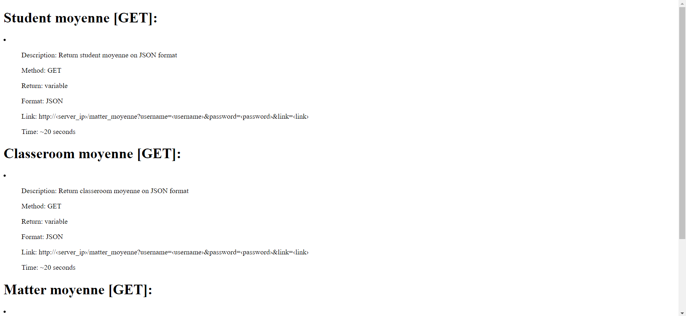
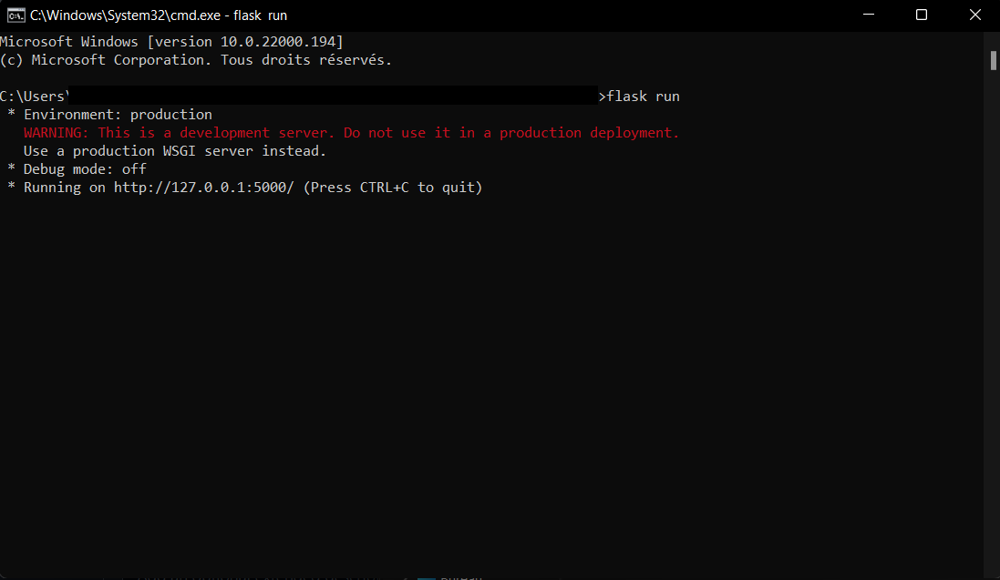

pronote-api
==========
### Unofficial pronote API
[](https://www.python.org/)
[](https://html.com/)
[](https://flask.palletsprojects.com/)
[](https://heroku.com/)


# How to use ?

## On your app
Vous devez juste envoyer une requete sur le serveur `http://deepcaps-pronote-api.herokuapp.com/`



Si tout les arguments son entrés correctements, le serveur enverra une réponse au bout de **~20 secondes** en format `JSON` ...


... sinon une erreur de type `Internal serveur error: 500` ou `null` sera renvoyée


### Example of request
> Vous devez remplacer les variables ici entre crochets **<>** par les elements demandés (ex.: *username=\<username\>* ==> *username=usernamepronote*)

Pour avoir la moyenne de chaque matière: `http://deepcaps-pronote-api.herokuapp.com/matter_moyenne?username=<username>&password=<password>&link=<link>`

Pour avoir la moyenne de l'élève: `http://deepcaps-pronote-api.herokuapp.com/student_moyenne?username=<username>&password=<password>&link=<link>`

Pour avoir la moyenne de la classe: `http://deepcaps-pronote-api.herokuapp.com/classroom_moyenne?username=<username>&password=<password>&link=<link>`

Les infos supplementaires sur les requetes sont ici : `https://deepcaps-pronote-api.herokuapp.com/`

## Local
> [Python](https://www.python.org/) et pip sont requis pour le fonctionnement du programme

Pour executer le projet sur votre machine local, il suffit de telecharger le repository avec

`git clone https://github.com/deepcaps/pronote-api.git`

> Il faut aussi installer les librairies necessaire au fonctionnement du programme avec la commande `pip install -r requirements.txt`

> ***ATTENTION*** la version de chrome (*chromedriver.exe*) n'est peut etre pas compatible avec votre version de chrome. Pour telecharger la version correspondante, cliquez [ici](https://chromedriver.chromium.org/downloads)

puis pour executer le programme il y deux solution, la première pour qu'il soit accessible par votre machine seulement avec l'ip *127.0.0.1:5000*

`flaks run`

et la deuxième qui permet que l'application soit accessible par tout votre reseau local avec l'ip de votre machine et le port *8000* (example: *192.168.0.25:8000*)

`python app.py`

> pour trouver l'ip local de votre machine, sous windows `ipconfig`, et sous linux `ifconfig`

Si tout ce passe bien vous devriez avoir un message similaire:




# A savoir
Le projet est une api ***NON OFFICIEL*** crée par **@deepcaps** et ebergé gratuitement par la plateforme [heroku](https://heroku.com/).

Aucune donnés de connexion à pronote n'est enregistrée par le serveur.

Les librairies utilisées sont:
- Flask
- selenium
- platform
- time

La version du code ebergé sur *heroku* diffère un peu de celle sur ce repository pour des besoins technique. Le principal changement ce trouve sur la configuration du driver:
```python
class connection():
	def drivers():
		global driver
		try:
			options = Options()
			options.binary_location = os.environ.get("GOOGLE_CHROME_BIN")
			options.add_argument('--headless')
			options.add_argument('--disable-dev-shm-usage')
			options.add_argument('--no-sandbox')

			driver = webdriver.Chrome(executable_path=os.environ.get("CHROMEDRIVER_PATH"), chrome_options=options)
		except:
			print ("An error has occurred: impossible to start webdriver")
			return False
		return True
```


# Me contacter
Vous pouvez me contacter a l'adresse [**deepcaps@outlook.com**](deepcaps@outlook.com) pour me faire parvenir les bugs ou les fonctionnalités à rajouter.


# Infos
[](https://github.com/deepcaps/pronote-api/)
[](https://deepcaps-pronote-api.herokuapp.com/)
